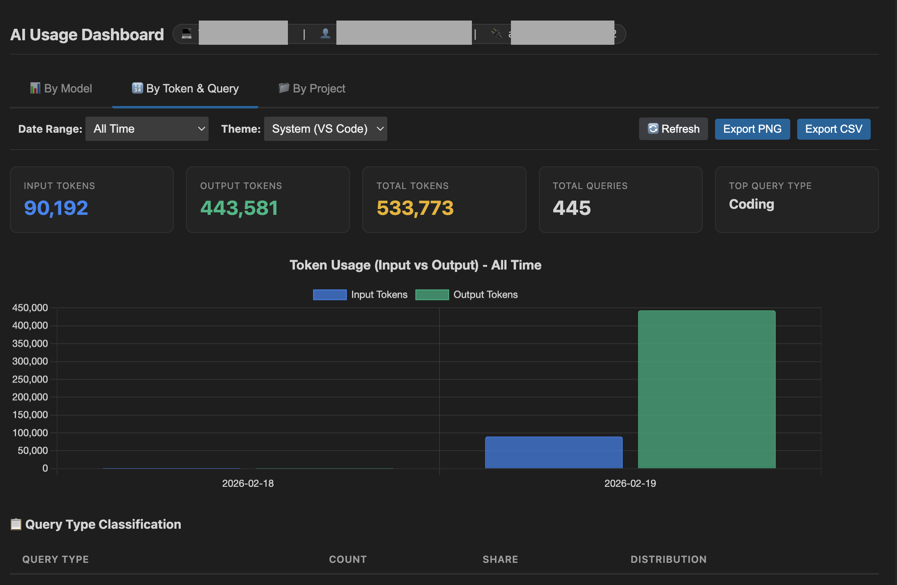
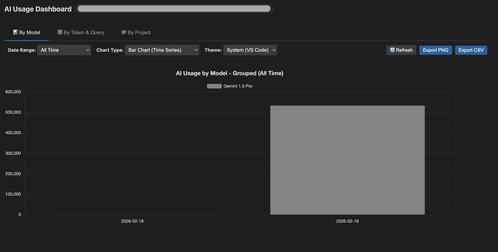
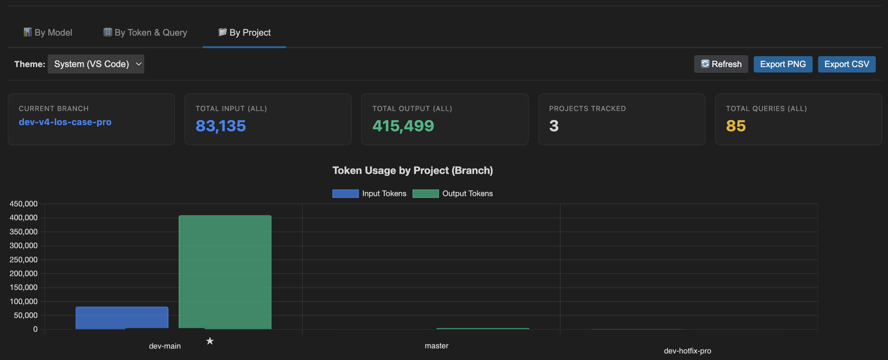

# Antigravity Monitor Extension

Complete AI usage analytics for your engineering team. Track, visualize, and gamify AI adoption within VS Code.

## 🚀 Features

### 📊 Comprehensive Analytics
- **Token Tracking**: Real-time monitoring of Input and Output token usage across different AI models.
- **Model Breakdown**: See which models (e.g., Gemini 1.5 Pro, GPT-4) are being used the most.
- **Query Classification**: Automatically categorizes usage into Coding, Debugging, Search, Planning, Documentation, and General Questions.

### 🏆 Team Dashboard & Leaderboard
- **Team Overview**: Get a bird's-eye view of your entire team's AI adoption.
- **Consolidated Leaderboard**: A gamified "Podium" view highlighting top performers based on total token consumption.
- **Project Insights**: Drill down into stats per project/workspace.

### 💾 Data Persistence & Portability
- **Secure Storage**: Usage stats are stored locally within VS Code's global state.
- **Export & Upload**: Easily export your stats to JSON and upload them to the central dashboard for team consolidation.
- **Drag-and-Drop Import**: The dashboard supports importing multiple user data files dynamically.

## 📸 Screenshots

| **Dashboard Overview** |
|:---:|
|  |
| *Visualize Input vs Output tokens and Query details* |

| **Model Breakdown** |
|:---:|
|  |
| *Track usage across different AI models* |

| **Project Insights** |
|:---:|
|  |
| *Drill down into usage by Project/Branch* |

## 🛠️ Usage

1. **Install the Extension**: Install the `.vsix` file in VS Code.
2. **Track Usage**: Use your AI assistants as normal. The extension runs in the background.
3. **View Metrics**:
   - Click the **"Antigravity: [Tokens]"** status bar item to see a quick summary.
   - Run `Antigravity Monitor: Show AI Usage Metrics` for a detailed breakdown.
4. **Export Data**: Run `Antigravity Monitor: Export Stats to JSON` to save your usage data for team analysis.

## ⚙️ Commands

- `Antigravity Monitor: Show AI Usage Metrics`: Display current usage stats.
- `Antigravity Monitor: Show Daily Token Usage Chart`: View a chart of daily activity.
- `Antigravity Monitor: Export & Upload to Dashboard`: Export stats for the leaderboard.

## 🔧 Installation for Development

1. Open this folder in VS Code.
2. Run `npm install` to install dependencies.
3. Press `F5` to launch a new Extension Development Host window.

